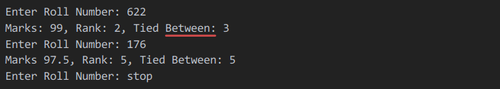
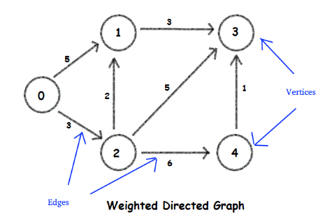

# Week 1 | Python

## Introduction 
Python is one of the widely used programming languages in the world. Python is an interpreted, object-oriented, high-level programming language with dynamic semantics. Its high-level built-in data structures, combined with dynamic typing and dynamic binding, make it very attractive for Rapid Application Development, as well as for use as a scripting or glue language to connect existing components together. Python's simple, easy to learn syntax emphasizes readability and therefore reduces the cost of program maintenance. Python supports modules and packages, which encourages program modularity and code reuse. The Python interpreter and the extensive standard library are available in source or binary form without charge for all major platforms and can be freely distributed.

## Resources

 - ### [I am new to Python - How can I learn the basics of Python](https://www.wiki.wncc-iitb.org/index.php/Python_for_Beginners) 
   _This is ideal for people who have either almost never coded in their lives, or were intimidated by CS101. Starting from what variables are, we'll see how Python can be used to automate many repetitive tasks in everyday life._
- ### [I am an intermediate Python developer - How do I start using packages for real-life use cases](https://www.wiki.wncc-iitb.org/index.php/Intermediate_Python_Programming)
  _Once familiar with the basic concepts of Python, this tutorial will help you consolidate them & explore a wide variety of packages & modules for different use cases._
- ### [I am an advanced Python developer - How do I learn deeper concepts in Python](https://www.wiki.wncc-iitb.org/index.php/Advance_Python_Programming)
  _If you think you are quite comfortable with Python, this tutorial will help you to extend your knowlegde base by exploring some advance concepts like threading, socket programming, etc._

## Tasks

### 1. Weather Data

The first task is to report the average temperature and humidity of some cities over a week.

The following information is given to help you:

In a file named `input.txt`, you have a list of n cities. Create the file yourself, and list any nummber of cities you want the data for.
You can use this [Website](https://www.wunderground.com) to scrape the required information, i.e. *Temperature* and *Humidity* of the cities given in `input.txt`.  

Scraping is essentially pulling text from an HTML page, programmatically. One can extract the HTML code directly, and then parse it for certain strings. In this case, the HTML code would contain the weather of city in question. One can store it as a string, and use normal string methods to extract useful information from it.  The wiki link below contains a how-to guide to scraping, along with any additional information you may need for the task.

Alternatively, you could use an Application Program Interface (API). This would essentially mean that you get the job done for you. You send a normal HTTP request to an API, and it returns data corresponding to what you asked for. This [Website](https://openweathermap.org/api) provides an API for the task.

Check [this](http://wiki.wncc-iitb.org/index.php/Web_Scraping) out for an overview and resources for Web Scraping.

##### Sample Input (Contents of input.txt)
>London                                                                                              
>Paris                                                                                                                                             
>Berlin                                                                                              
>Frankfurt

##### Sample Output (Could either be a new file or terminal)
>London      13        80%                         
>Paris       20        78%     
>Berlin      17        83%                                                                                                              
>Frankfurt   16        81%

### 2. Fetch My Rank

A Physics Professor has just uploaded a sheet with marks of the 1000 freshmen who did his course. All the students want to know their ranks so that they can predict their grade. It’s very tedious to search for a given roll number and calculate their rank. Let's automate this!

Your task is to create a script which keeps running and fetches the rank of a input roll number from the given `.csv` file. The valid range of roll numbers is from 1-1000. All are integers with no missing roll numbers. The script should keep running till the user types *`stop`*.
The script should do something like this - 

This is just an example. [Here](./marksheet.csv) is the `.csv` file containing the required data to be used for this task. 

### 3. Understanding Graphs

A graph is a pictorial representation of a set of objects where some pairs of objects are connected by links. The interconnected objects are represented by points termed as vertices, and the links that connect the vertices are called edges.
In a graph each of the edges can have a weight and an arrow depicting the direction.

*In figure* :

- Circles represent vertices. Each vertex has a name (0,1, 2,3,4)
- Arrows between vertices represent edges. (Edge between 1 --> 3)
- Each edge has a weight associated with it. (Edge between 1--> 3 has a weight =3)

**Input**:

Input to the task will be a graph in the following format: 
Connections: [[1, 2], [3], [1, 3, 4], [], [3]]

Weights: [[5, 3], [3], [2, 5, 6], [], [1]]

For the above format input example will be: 

>5  
>2  
>1  5  
>2  3  
>1  
>3  3  
>3  
>1  2  
>3  5  
>4  6  
>0  
>1  
>3  1  

First line represents the number of vertex.    
Next line shows the number of connections to 0th  vertex (i.e. 2)  
Next 2 line shows the connected vertex and weight of edge to 0th vertex to connected vertex and so on.

To understand more about graphs, we'll implement **2 algorithms**:

#### Algorithm 1: Dijkstra's Shortest Path 
Given a source vertex, say vertex 0 you need to find the shortest path (the path with least weight) to all other vertices in the graph.   
**Output** : The minimum distance of each vertex from the given source vertex.

Refer to this [pseudocode](https://brilliant.org/wiki/dijkstras-short-path-finder/) to learn about the algorithm.     
Hint: Use `math.inf` to initialize distances.

#### Algorithm 2 : Breadth First Search (BFS)
Breadth First Search (BFS) algorithm traverses a graph in a breadthward motion and uses a queue to remember to get the next vertex to start a search, when a dead end occurs in any iteration.

**Output**: Print the breadth first traversal of the graph given in problem 1.   
Example: BFS for the example graph will be 0 2 1 3 4  

Refer to these sites to learn more about BFS - [HackerEarth](https://www.hackerearth.com/practice/algorithms/graphs/breadth-first-search/tutorial/), [TutorialsPoint](https://www.tutorialspoint.com/data_structures_algorithms/breadth_first_traversal.htm)

### 4. Telegram Bot

If you have joined our [Telegram](https://t.me/joinchat/Go8oWRUqXsSufvCA75qMUQ) group, surely, you too would have been annoyed by the repeated notifications/messages of new people joining the group. So we give you the task of coding a Telegram Bot that automatically removes messages stating that a new person has joined the group, given it has admin privilages. Going through [this official documentation](https://python-telegram-bot.readthedocs.io/en/stable/) will certainly be useful. You might find this well documented [website](https://github.com/python-telegram-bot/python-telegram-bot/wiki/Code-snippets) more friendly and easy to understand if you are unable to comprehend the official documentation.

