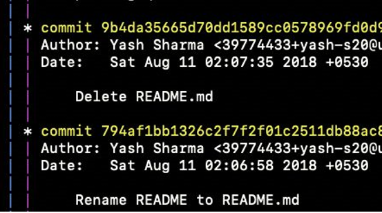
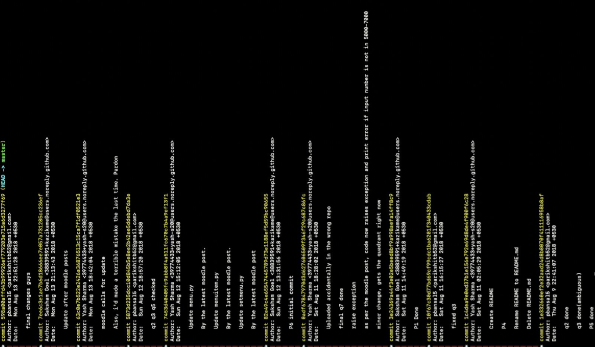

# Week 4 | Git/GitHub

## Introduction 
Git is a Version Control System which helps you collaborate and work with other programmers on projects easily. So now the question is what is a Version Control System? Version Control is a system that records all the changes you do to your files and logs them. This enables you to go back to them and start working on your files from that point. It's basically like time travel. If while working on your files you realise that you have done something majorly wrong but can't sit and undo every change. The best option for you is to ask your version control system to simply go back to the instance from where you want to start again. 

As you can see, having a version control system has a lot of benefits. It helps to keep track of previous versions of your code. On the other hand, GitHub is a code hosting platform for version control and collaboration. It lets you and others work together on projects from anywhere.

Whether or not you're working in a team you'd really want to use a Version Control System for managing project and a platform like GitHub to host your own code and share it with others. 

Version Control System is also an important tool for Open Source software. Open source software is software with source code that anyone can inspect, modify, and enhance. They use platforms like github to host the code and make it available for everyone.

Follow the following resources to get acquainted with these important tools and begin collaborating with the world!

## Resources

- ### [Git - A Version Control System](https://www.wiki.wncc-iitb.org/index.php?title=Git)
- ### [Github - A Code Hosting Platform](https://www.wiki.wncc-iitb.org/index.php?title=Github-tutorial)
- ### [Open Source basics](https://www.wiki.wncc-iitb.org/index.php?title=Open_Source) 

## Tasks

### 1. Git Squashing

Git squashing is an excellent way to keep commit histories clean, organized, and formal. The task is simple. Download the file [q4.zip](./q4.zip). It has a git folder named q4. 

 `git log --all --graph`

This command will give you the entire commit history of this git folder q4. It has 23 commits in total, from three different users, even on different bases that were later merged. Your task is to squash all consecutive commits from a user into a single commit.  
Here's how it looks right now:   

   

Here's how it must look finally:   

### 2. [Git Game](https://github.com/git-game/git-game)

Once you are familiar with git and github give this a try. This is a terminal game designed to test your knowledge of git commands. Each level in the game is a task to perform on this repo.  Once you perform that task, you will be given your next task. There are a total of ten levels, each one harder than last!

### 3. [Git Branching](https://learngitbranching.js.org/)

Head to this link to practice and understand the concept of branching in git with an online git repository simulator. 
  
### 4. [First Contribution](https://github.com/firstcontributions/first-contributions)

Make your first Open Source contribution. 

