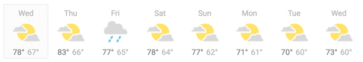
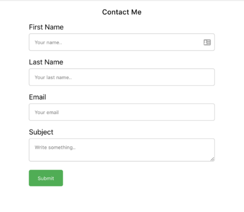
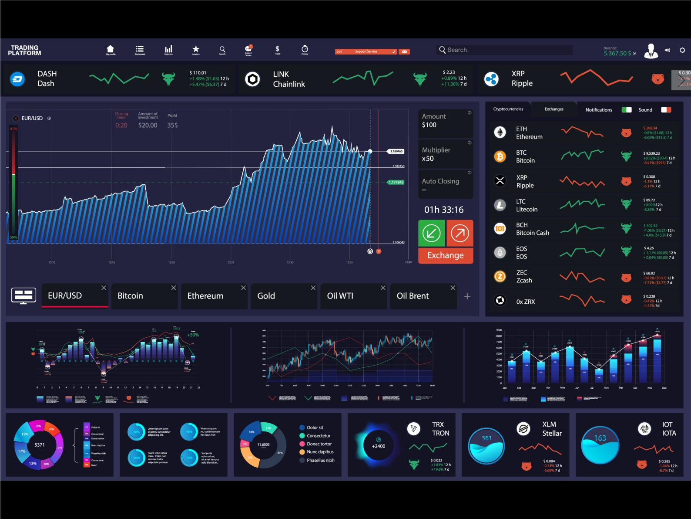

# Week 7 | Advanced Frontend Development

## Introduction

Back in the day, web developers would implement front end logic by relying heavily on vanilla JS and jQuery. But, as front end applications became more and more complex, the tools rose to meet that complexity and Javascript Frameworks came into picture.
A **JavaScript framework** is a tool that you can leverage to develop advanced web applications.. At their most basic, JS frameworks are collections of JavaScript code libraries that provide developers with pre-written JS code to use for routine programming features and tasks—literally a framework to build websites or web applications around.

Think of building websites and web apps like building a house—when you set out to build a house, you could create all of your own building materials from scratch and start building without any schematics, but that approach would be incredibly time-consuming and doesn’t make a lot of sense. It’s more likely that you would purchase pre-manufactured building materials (wood, bricks, countertops, etc.) and then assemble them based on a blueprint to fit your specific needs.Coding is very similar. When you set out to code a website, you could code every aspect of that site from scratch, but there are certain common website features that make more sense to apply from a template. And that’s where JavaScript frameworks come into play.

**JS libraries** like jQuery are used by plugging library code into the rest of your site’s code when needed while with a framework the process is more holistic—a framework doesn’t just offer an individual solution to a coding problem, it provides a structure (like a skeleton or a scaffolding…or a framework) that organizes the parts of your site where the framework is implemented.

[Here](https://blog.logrocket.com/history-of-frontend-frameworks/) is an interesting read if you would like to read about the history of frontend frameworks.

**Native app development** is the creation of software programs that run on specific devices and platforms. Unlike websites and web applications, native mobile apps don’t run in the browser. You need to download them from platform-specific app stores such as Apple’s App Store and Google Play. Native app development requires different skills and technologies than mobile website development. You don’t have to worry about browser behavior and compatibility. You can use the native features of mobile OSs to deliver the user experience and implement the functionalities of your app. 

## Resources

- ### [ReactJS](https://www.wncc-iitb.org/wiki/index.php/ReactJs)
	*React is a front end tool to build both UI components and whole UIs – everything that concerns putting together visual elements, binding data to those elements, and specifying the logic governing it. Head to this link to more and learn how to build web apps with React*
	
- ### [Angular](https://www.wncc-iitb.org/wiki/index.php/Angular)
	*Currently, one of the most popular frameworks for frontend development, Angular is a TypeScript-based open-source web application framework led by Google. While React is more geared towards being as flexible as possible, giving developers the choice of architectures and structures. Angular, however, enforces a certain structure onto the project.* 

- ### [Android App Dev](https://www.wncc-iitb.org/wiki/index.php/Android_App_Development)
	*Head here to get to know about the fundamentals of App Development*

- ### [Android Studio Tutorial](https://www.wncc-iitb.org/wiki/index.php/Android_Studio)
	*Android Studio is Android's official IDE. It is a framework that includes every tools necessary to develop native Android apps. Head to this link to start making your first android application.*

## Tasks

### 1. React/Angular
#### a) Weather App
Display a 5-day weather forecast, where each day shows the high and low temperatures, and an image for sunny/rainy/cloudy/snowy. Use hard-coded data until you’ve got everything rendering correctly.

  

For added practice, here are a few ways you could expand on the app:
- Add the ability to click on a day, and see its hourly forecast.
- Add React Router to the project and follow the quick start guide [here](https://reacttraining.com/react-router/web/guides/quick-start) to add routes, such that "localhost:3000/" shows the 5-day forecast, and "localhost:3000/[name-of-day]" shows the hourly forecast for a particular day.
- Sign up for a free API key from [Open Weather Map](https://openweathermap.org/api), fetch a real 5-day forecast, and feed that data into your app.

#### b) Contact Us App
All websites have a Contact Us page which allows the customer to enter their details and send their messages/queries directly from the website. 
- Your task is to create this Contact Us component in React having the fields as shown in the image below. This Contact Us component can then be easily integrated with any website/web app. The form should be complete with validation for fields like email and all fields are compulsory. 
- Finally, we have to send an email from the customer's email account to our email account with the contact form data. This will be handled from the backend. For the backend part you will need a web server. 
- You have to make an API which will take form data from the front end and handle the email functionality. You can chose to use any backend framework/language for this purpose.  

	

#### c) Stock Market Dashboard
Investors and analysts typically analyze the price movement of any stock before investing in it, so the graphical representation of this trend makes analysis easier. Through this task, we will create a dashboard to visualize and compare the stock prices of different companies (like GOOG, AAPL, GOOGL, AMZN, etc.).

* To get started with such dashboards, the easiest way is to pick up a __Template__ & start modifying it according to your needs. There are tons of free templates avaiable for use (both for React & Angular). Here are some websites that offer great free templates:
	* [Angular Dashboard Templates](https://www.codeinwp.com/blog/best-angular-admin-dashboard-templates/)
	* [React Dashboard Templates](https://material-ui.com/store/collections/free-react-dashboard/)
* Next, the most important aspect of this task is to obtain the data about stock prices. This can be done by leveraging APIs that offer such services. Some interesting APIs that can be queried to obtain stock-related data are:
	* [IEX API](https://iexcloud.io/docs/api/)
	* [Tiingo API](https://api.tiingo.com/documentation/general/overview)
	* [World Trading Data API](https://www.worldtradingdata.com/documentation)

	_Note: Most of these APIs are free for a certain threshold of requests (per hour basis), so go through the rate limits carefully_

	Here are some tutorials that will help you understand how to send requests to API endpoints from Angular/React & use the obtained results:
	* [Angular REST API & Httpclient Tutorial](https://www.djamware.com/post/5d8d7fc10daa6c77eed3b2f2/angular-8-tutorial-rest-api-and-httpclient-examples)
	* [React API Usage Tutorial](https://pusher.com/tutorials/consume-restful-api-react)

* Once built, your dashboard should look something similar to the image below (though not that complex! :P). The basic features include:
	* Allow a user to see the stock prices history of a particular company
	* Compare prices of stocks for different companies
	* Show details about stocks (trading volume, market cap, opening & closing prices, etc.)
	* You can add any more features that you wish to
	* _Bonus: With prior knowledge of ML & Backend Development, you could create a model to predict stock prices, expose this service as a REST API through a backend framework & integrate it with your dashboard to predict future stock prices of a company_

	

### 2. Android Studio
#### a) To-do App
Make the classic To-Do app, with a layout and features that suit you. You could use it in your daily life too. [Here](https://github.com/avjinder/Minimal-Todo) is an implementation.

#### b) Pedometer
Make a simple, light-weight pedometer app which uses the hardware sensor of the device to calculate the steps taken. Find an example [here](https://github.com/j4velin/Pedometer).
